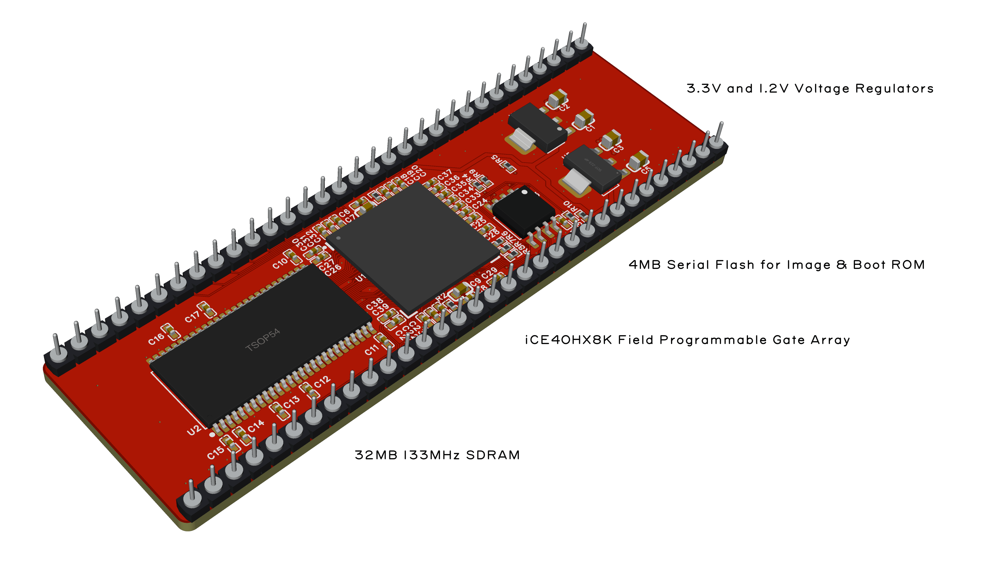
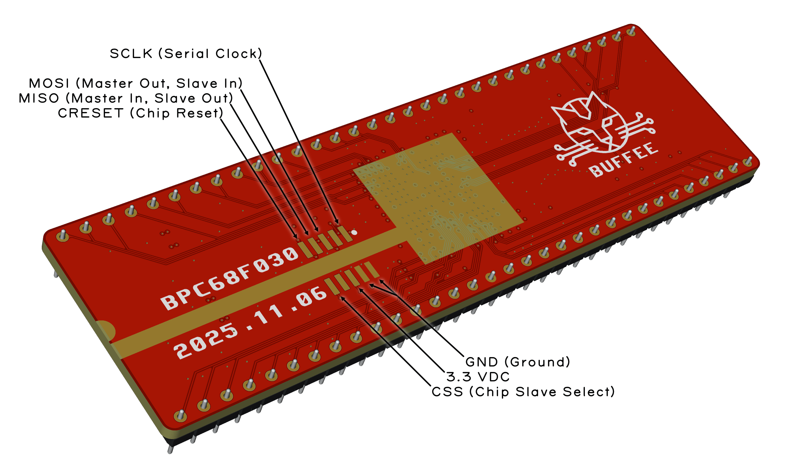

# Buffee Nano "Cheerleader Edition"

This is the repository for Buffee Nano, the very, very lowest end FPGA Amiga accelerator. It features an iCE40HX 8K with 7680 LUTs and 32MB of 133MHz SDRAM. It's a flip-chip design so if printed with a black solder mask, this will look right at home in any vintage PCB.

## Programming
 The iCE40 HX is loaded via the SPI Flash chip. This is programmed through a 10-pin header that ias accessible from the top side. You may either solder-on a SMT 10-pin Cortex ARM style header here, use pogo pins or simply solder some wire leads from it.

